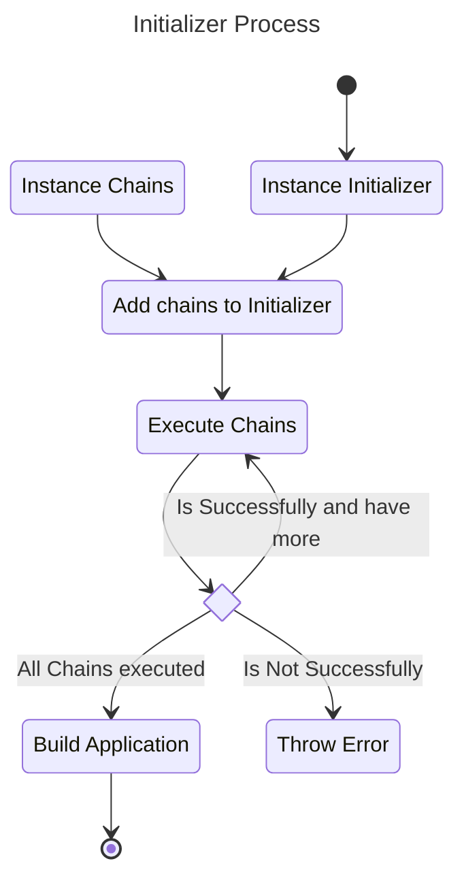

# Initializer Chain - 2024/09/02 #

## Context

The application initialize process is one of the most crucial parts of this application, and currently is widespread
across many steps and don't have any regular structure. The process and logic is a mess and needs to be fixed ASAP. 

## Decision

### Chain of Responsibility

Use the Chain of Responsibility pattern to define multiple steps on the `Application` build process. Each one decide if
the process must be continued or not.

The whole process will be handled by the `InitializationHandler` class, in charge to run each step, log the process
and perform the final build into a `Application` class.

All chan must be implements an `InitializationChain` to execute their logic, decides if executes the next or throw an
error explaining why it fails.

Each task could be provided using context objects to help their task or add owned object instances to the context tho
help other tasks. The `InitializerContext` will be used for, defining methods and strategies to set and get instances.

#### Why?

The initialization process requires many agents to perform it. Most of them, requires previously another processes to
be able to run, then needs other processes before.  

#### How?

Each Chain can decide if next step can be executed calling them self, also can add additional objects to the init
process.

## Consequences

- 
